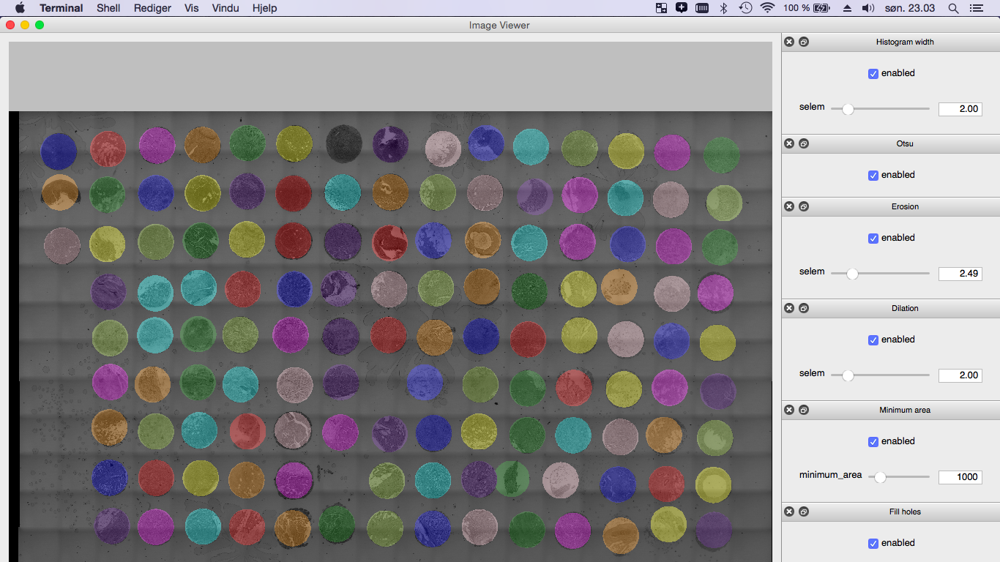

leicaautomator
==============

|build-status-image| |pypi-version| |wheel|

Overview
--------

Automate scans on Leica SPX microscopes

Requirements
------------

-  Python (2.7, 3.4)

Installation
------------

Install using ``pip``...

.. code:: bash

    pip install leicaautomator

TODO: note about qt

**Mac users:** Run PySide post install:

.. code:: bash

    pyside_postinstall.py -install

Example
-------

Documentation
-------------

Read API reference: http://leicaautomator.rtfd.org/

Development
-----------

Install dependencies and link development version of leicaautomator to
pip:

.. code:: bash

    git clone https://github.com/arve0/leicaautomator
    cd leicaautomator
    pip install -r requirements.txt

run test
^^^^^^^^

.. code:: bash

    tox

extra output, jump into pdb upon error
^^^^^^^^^^^^^^^^^^^^^^^^^^^^^^^^^^^^^^

.. code:: bash

    tox -- -s --pdb

build api reference
^^^^^^^^^^^^^^^^^^^

.. code:: bash

    pip install -r docs/requirements.txt
    make docs

.. |build-status-image| image:: https://secure.travis-ci.org/arve0/leicaautomator.png?branch=master
   :target: http://travis-ci.org/arve0/leicaautomator?branch=master
.. |pypi-version| image:: https://pypip.in/version/leicaautomator/badge.svg
   :target: https://pypi.python.org/pypi/leicaautomator
.. |wheel| image:: https://pypip.in/wheel/leicaautomator/badge.svg
   :target: https://pypi.python.org/pypi/leicaautomator
